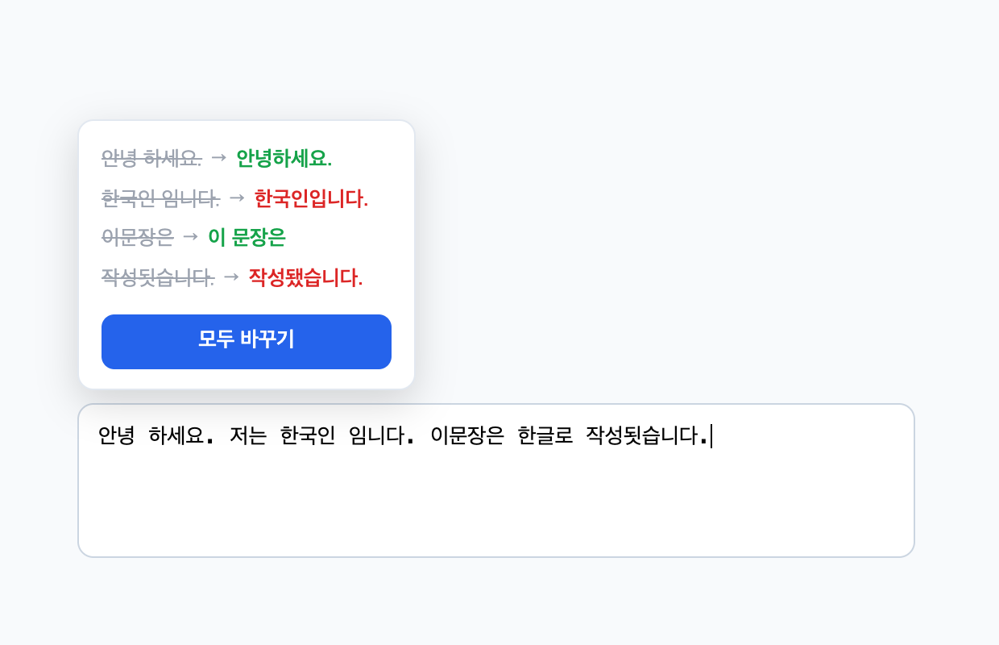

<p align="center">
  
</p>

<h1 align="center">supell</h1>

<p align="center">
    <a href="https://search.naver.com/search.naver?query=%EB%A7%9E%EC%B6%A4%EB%B2%95%20%EA%B2%80%EC%82%AC%EA%B8%B0">네이버 맞춤법 검사기</a> 기반 한글 맞춤법 검사 크롬 Extension
</p>


<p align="center">
  
</p>

## 수동 설치 방법

```bash
npm install
npm run build
```

1. 크롬에서 `chrome://extensions` 접속
2. `압축해제된 확장 프로그램을 로드` 클릭
3. `.output/chrome-mv3` 폴더 선택

## 기능

### 쓰면서 검사하기

입력창에 글을 쓰다가 잠시 멈추면 결과 모달이 뜹니다.

- 교정 항목 클릭 → 그 부분만 교체 (모달 유지, ✓ 표시)
- 모두 바꾸기 → 전체 교체 후 모달 닫힘
- 모달 바깥 클릭 → 닫힘
- 비밀번호, 숫자처럼 문장이 아닌 입력창에서는 동작하지 않습니다.

### 드래그해서 검사하기

텍스트를 블록 지정하고 커서 옆에 뜨는 로고 버튼을 누르세요.   
입력창이나 편집 가능한 영역 안의 선택이면 교정을 적용할 수 있고, 읽기 전용 텍스트라면 결과만 보여줍니다.

### 교정 유형

교정된 단어는 네이버 맞춤법 검사기와 같은 기준으로 색이 입혀집니다.

| 색 | 의미 |
|----|------|
| 🔴 빨강 | 맞춤법에 문제가 있는 단어 또는 구절 |
| 🟢 초록 | 띄어쓰기에 문제가 있는 단어 또는 구절 |
| 🟣 보라 | 표준어가 의심되는 단어 또는 구절 |
| 🔵 파랑 | 통계적 교정에 따른 단어 또는 구절 |

## 프로젝트 구조

맞춤법 검사 자체는 네이버 검색의 맞춤법 검사기가 쓰는 API(`SpellerProxy`)로 처리합니다.   
`passportKey`는 백그라운드가 알아서 가져와 저장해 두고, 만료되면 다시 발급받습니다.

```
entrypoints/
├── background.ts       네이버 API 호출, passportKey 관리
└── content/
    ├── index.ts        입력 멈춤 감지, 드래그 선택 감지
    └── ui.ts           모달과 로고 버튼 (Shadow DOM)
utils/
├── naver.ts            SpellerProxy 클라이언트
├── chunk.ts            긴 글을 공백 경계에서 분할
├── parse.ts            응답 HTML을 (원본 → 교정) 목록으로 파싱
└── types.ts            공용 타입
```

## 사용에 대한 안내

이 확장 프로그램은 [네이버 맞춤법 검사기](https://search.naver.com/search.naver?query=%EB%A7%9E%EC%B6%A4%EB%B2%95%20%EA%B2%80%EC%82%AC%EA%B8%B0)를 바탕으로 만들어졌습니다.

검사에 사용하는 엔드포인트는 공식적으로 공개되지 않은 네이버 내부 API입니다.   

예고 없이 스펙이 바뀌거나 접근이 막힐 수 있으며,   
교정 결과를 포함해 검사기가 만들어 내는 모든 데이터의 권리는 주식회사 네이버에 있습니다.  

상업적으로 사용하거나 불법적인 용도로 사용한다면 해당 부분에 대해서는 개발자가 책임지지 않습니다.

## 라이선스

[MIT](LICENSE) © vumrra
